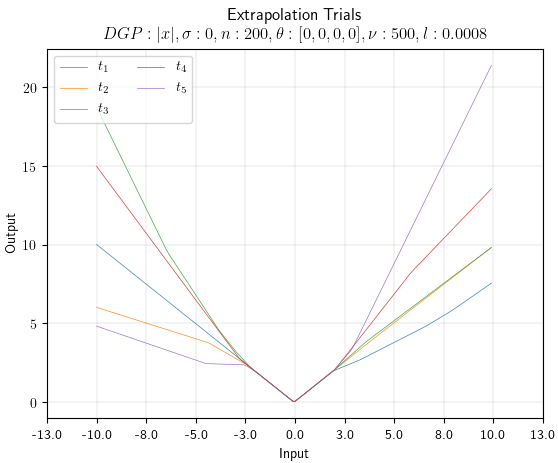
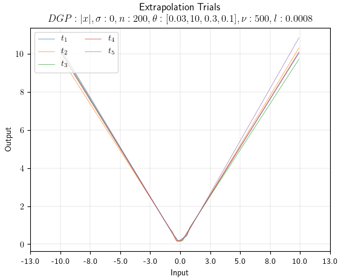

# ReLEx
> This study covers Extrapolation behaviour control

## Table of contents
* [General info](#general-info)
* [Inspiration](#inspiration)
* [Screenshots](#screenshots)
* [Technologies](#technologies)
* [Setup](#setup)
* [Features](#features)
* [Contact](#contact)

## General info
Despite the great success of neural networks in recent years, they are not providing useful extrapolation behaviour. 
Their behaviour is determined mostly by weight initialisation and largely independent of the training data. 
The popular Rectified Linear Units do enable linear extrapolation and we introduce a set of loss terms that, when added to the standard loss, greatly reduce the variance of the extrapolation and realise the desired behaviour at no cost in terms of standard learning behaviour. 
We present an implementation on single input and single output feed-forward networks. Results demonstrate to support our points and make neural network extrapolation behaviour more predictable at no additional computation cost at inference time.

## Inspiration
Project inspired by Trask(2108), Martius(2016, 2018)

## Screenshots

## Technologies
* [version](https://img.shields.io/badge/version-1.1-green)
* [coverage](https://img.shields.io/badge/completion-80%25-yellowgreen)
* [implementation](https://img.shields.io/badge/implementation-PyTorch-red)
* [license](https://img.shields.io/badge/license-AGPL-blue)

## Setup
* The project is not compiled as a pip installation package yet. Future releases might include this.
* Local environment was setup in IntelliJ. 
* Dependencies Packages needed are 

`import torch
from torch.autograd import Variable
import torch.nn.functional as F
from torch.utils.data import Dataset, DataLoader
from torch.utils.data.sampler import SubsetRandomSampler
`

## Forces
### Centripetal Loss
Force that pulls the kink into a certain range
the range could be determined automatically
percentile is one viable option when dealing in single dimension
this does not apply to multidimensional scenarios to draw the boundaries

`def centripetal_f(model, x_train):
    kinks = -model.hidden.bias/model.hidden.weight.reshape(1,-1)
    L1_new = kinks - x_train
    loss = L1_new.pow(2).sum()
    return loss
`

### Mutually Repellent
This force aims to equally distribute the kinks
by applying a gradient derived from the loss of the total
sum of element wise distance

`def mutuallyrep_f(model):
    kinks = -model.hidden.bias/model.hidden.weight.reshape(1, -1)
    k = torch.zeros((1, model.hidden.weight.size()[0]), requires_grad=True)
    k = torch.add(kinks, k)
    hid_n = model.hidden.weight.size()[0]
    inv = torch.zeros((1, 1))
    for z in range(int(1)):
        for j in range(int(hid_n)):
            inv1 = 1.0/((k[:, j] - k[z, :])**2.0 + 1)
            inv = inv1.sum() + inv
    loss = torch.sum(inv).sqrt()
    return loss
`

### Weight Orientation
Intuitively speaking we want the movable part of the relu to point outward
the weight needs to depend on the position of the kink with respect to the
center of the data

`def orient_k_f(model, x_train):
    kinks = -model.hidden.bias / model.hidden.weight.reshape(1, -1)
    km_diff = (kinks - x_train.mean())
    km_diff_w = km_diff * model.hidden.weight.reshape(1, -1) + 0.0001
    c2 = km_diff_w < 0.0
    c21 = c2.to(torch.float) * -km_diff_w
    loss = c21.pow(2).sum()
    return loss
`

### Weight Sign
This loss should ensure the presence of both signs in the weights
we therefore measure a loss proportional to the difference of the sign of the two
this should be ensured by thew distribution of kinks force mutually repellent force

`def signrepel_f(model):
    s_w = model.hidden.weight.reshape(1,-1)
    tot_sign = s_w.sum().pow(2)
    loss = torch.sum(tot_sign)
    return loss
 `

## Code Examples
Examples of usage:

`RLoss_Train_store, RLoss_Val_store, RLoss_Test_store, \
    RLoss_True_store, RLoss_WLS_store, RLoss_Tang_store, \
    RPred_store, RTrained_Models, RparamDict, RresultDict = train()
`

## Features
* Single Impulse
* Single Response
* Single Hidden layer
* ReLU activation function
* Zero Noise data

To-do list:
* Multiple impulses
* Multiple responses
* Deeper hidden layer
* Heteroskedastic noisy data
* Real Data-Set

## Contact
Created by Enrico Lopedoto {enrico.lopedoto@city.ac.uk} and Tillman Weyde {te.weyde@city.ac.uk} @ Computer Science Department, City, University of London.

